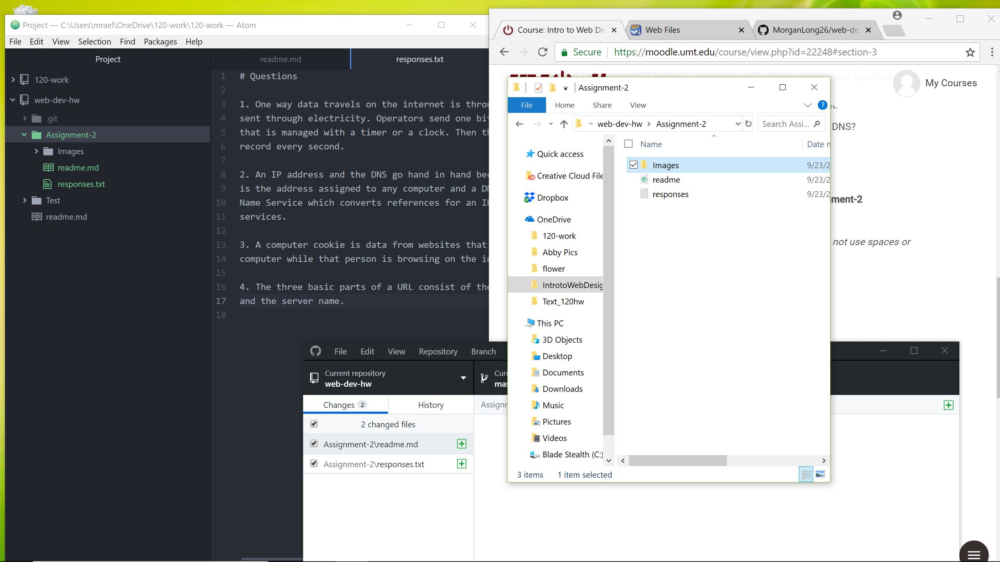

# Assignment 2 Readme

Version Control System is a software configuration that manages the changes to documents, websites, computer programs, and other collections of information. (Wikipedia)
We are using this for this class because of the reasons stated above. This system helps us changes documents and code for the purpose of web design and development.

[Response Text](https://github.com/MorganLong26/web-dev-hw/blob/master/Assignment-2/responses.txt)

## Work Cycle
For this assignment I went throught all of the tabs on the courses website. I watched the videos and followed along with the examples. I learned several new things, such as, how we send via the internet, what version control is, what cookies are, ect.

I didn't struggle that much with this assignment. I found that if you go through all of the tabs of information and all of the examples you will be fine. If I had any questions the follow along examples helped. I didn't post any issues on the repo issue because I was able to figure out the problem.

