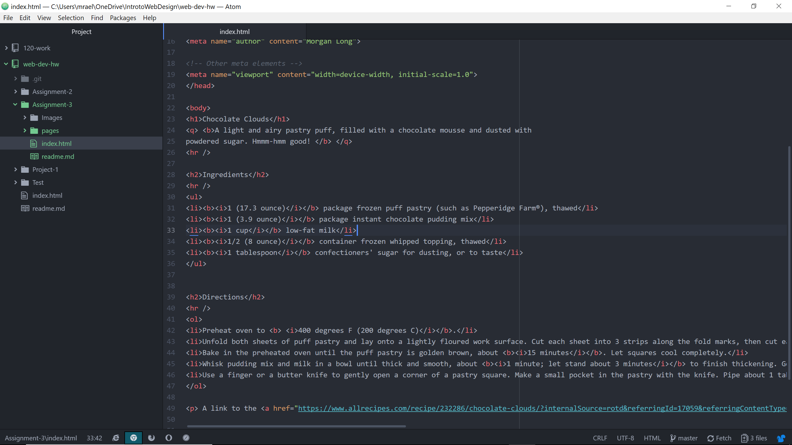

# README.md
- There can only be one main head and one main body element for a page. The head element has all the information about the meta data and title, so the things that the user doesn't see. The Body element is in control of everything the user will see on the screen.
- Structural markup is dealing with the appearance of the site such as the paragraphs, divisions, titles, etc. The sematic markup is dealing with the text such as h1. This identifies h1 as the main header so it will make it the largest on the screen.

## Work Cycle
1. I began by going to the course website and going through all of the tabs and seeing what new topics we are learning.
2. I then began my assignment in atom get the basic format finished.
3. Then I found a recipe and incorporated it into the code of the site.
4. If I ran into an issue I would refer back to the course website.
5. Lastly, I did my readme and submitted my links to moodle.

