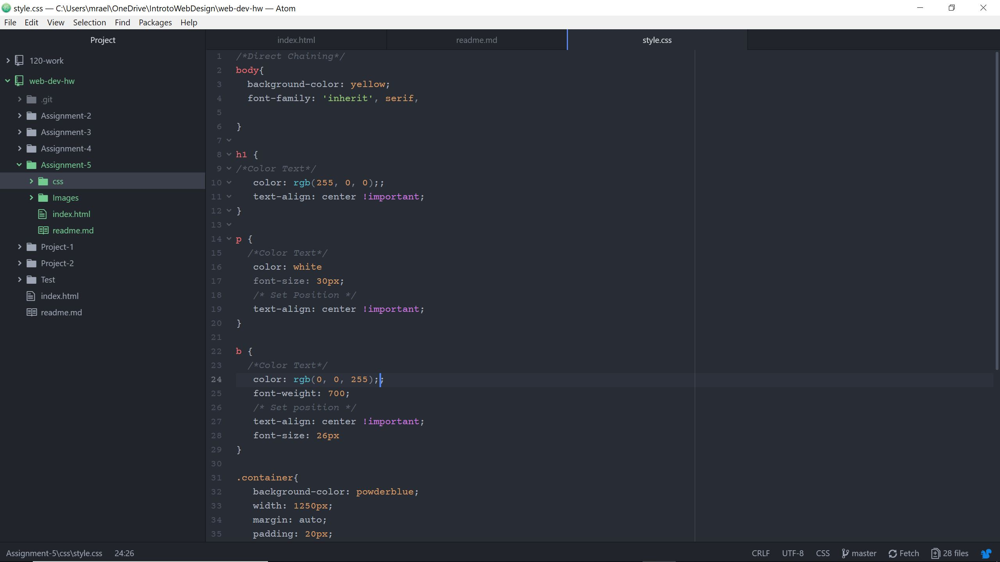

# README.md
For this assignment I chose to do the 1980s. My  parents went to high school in the 80s so I referenced some of their old photos to get a general idea of what the style was. The graphics I chose were 1980s-03 and 1980s-05. I liked the boldness, clashing of colors, and patterns. I wanted it to show clashing colors some neon some muted. I wanted to show blocking colors and patterns because those were very popular in the 80s.

My color palette was a mixture between bright neon colors and muted colors. For the bright neon red I used (255, 0, 0), for the green I used (0, 255, 0), and for the blue I used (0, 0, 255). For the other colors I typed in the names such as yellow, white, and powder blue. In my research I noticed it was very popular to clash color and print to appear more bold. I ended up changing the opacity to make the divs appear more muted. While the border, text, and background were saturated colors.

## Work Cycle
- I started by going on to moodle and reading what are assignment was.
- I then chose a decade and did some research so I had a general idea of the style.
- I then went on to the course website and went through all of the tabs to learn about the new information.
- After going through the tabs I began my project.
- If I had any questions I would refer back to the course website.
- After completing the assignment I finished the readme and submitted my links to moodle.

## Screenshot
 
