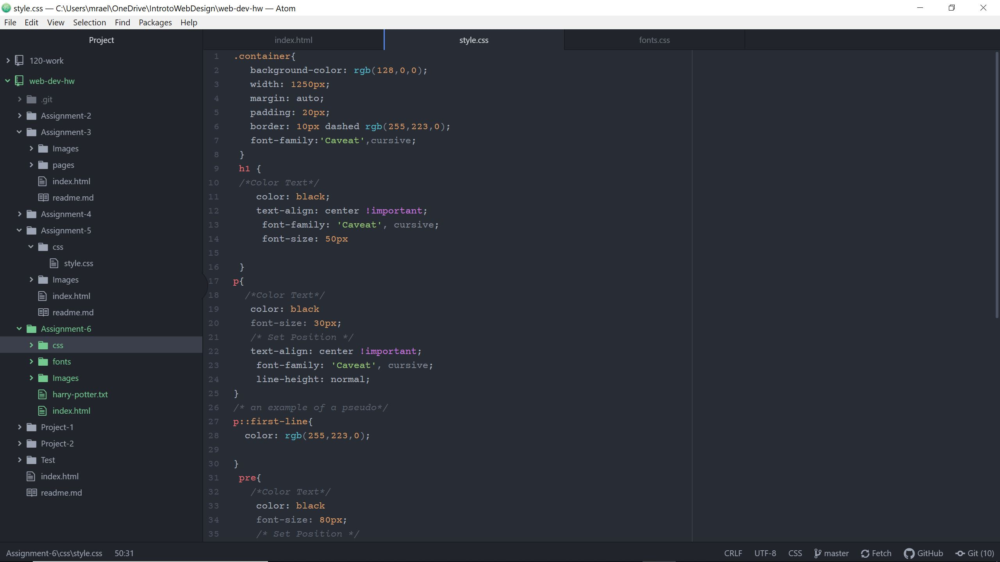

# README.md
1. For this assignment I chose to do the Harry Potter prompt. The fonts I chose was Kalem and Caveat. These fonts remind me of stereo typical school fonts, and that was what I was shooting for because Hogwarts is a school.
2. System fonts are fonts that are from the users computer. Web fonts are fonts that can be on the computer and the internet. Web safe fonts are the fonts that are already installed fonts. The importance of fall back fonts are when one of the fonts you have doesn't connect with the preset fonts on the users computer, so the computer uses the fall back font so the user will still be able to see and read the text.
## Work Cycle
- I first began by reading what the assignment.
- Then I went to the course website and read and watched all of the new tabs of information.
- After that I chose which prompt I wanted to use for my project.
- I chose Harry Potter, so while doing the assignment I made everything color coordinate to Griffindor colors.
- If I had any issues or questions I referred back to the course website.
- Lastly, I pushed all of my things to GitHub and Submitted my links to moodle.
## Screenshot

