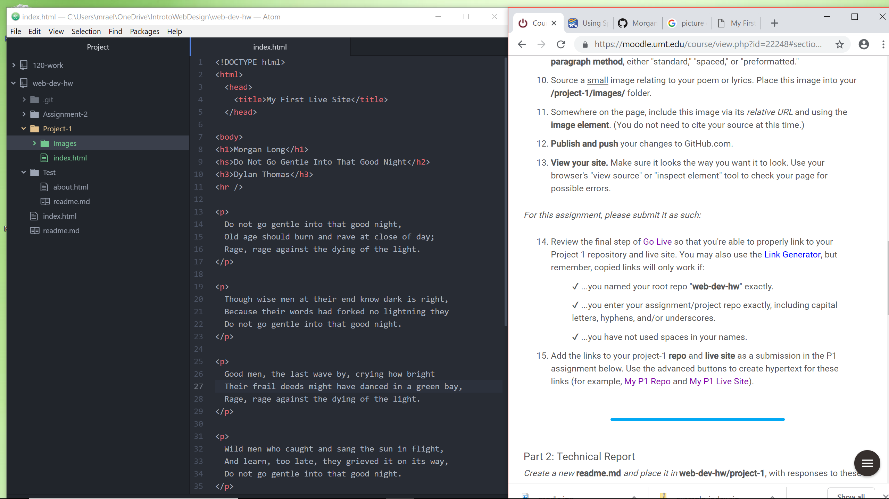

# Project One Readme

The browsers I mostly utilize are Google Chrome and Mozilla Firefox. A web browser is a software program that a user can use to access the internet. How it works it that the user send a request to the server and response with content. Such as png, jpg, html, and css. Once the browser gets the content it displays it on the screen. First there is the interface, second is the rendering engine, third is the browser engine, fourth is the network, fifth is the JAVA Script Interpreter, and sixth is data storage.

When I went on the Wayback Machine, I focused on the times between 1992 and 1993. In 1992 it looked like the old fashion black screen with green text and nothing else. A year later the interface had a distinct outline with buttons that almost had a 3D effect and a light background instead of the all black background with just text. It has changed so much from the appearance, going from an all black background with just text to any color you want with text, pictures, videos, etc. Being able to interact with the interface and also being able to find many more things on browsers as well.

## Work Cycle
- I began by going through all of the tabs on the course web site and following along with the tutorials.
- Then I began my project, and if I had any questions or issues I referred back to the course website.
- Once I finished I published the website and pushed everything to GitHub.
- Lastly, I uploaded my links to moodle and assessed two of my peers websites.  

### Workspace

