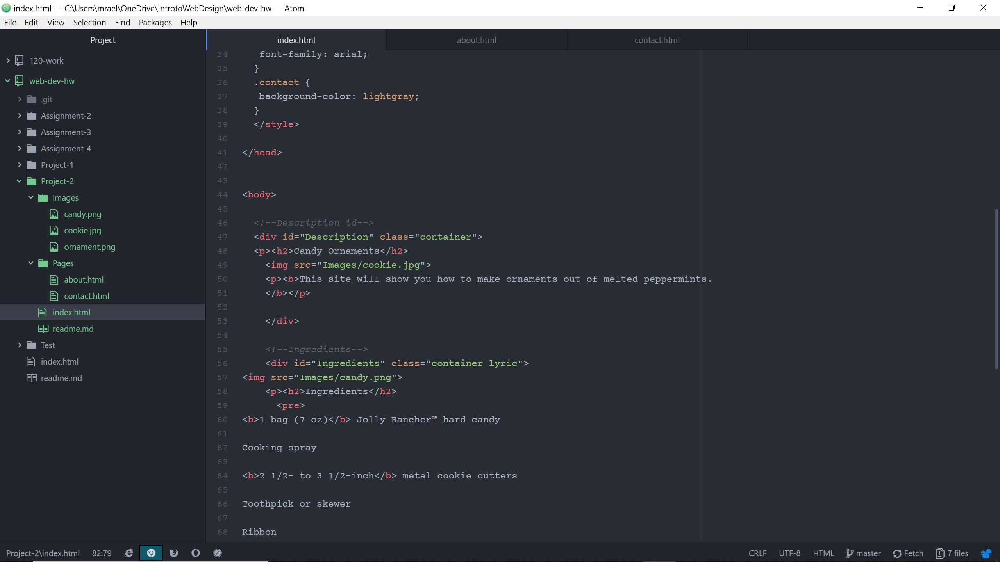

# Readme.md
- It was new to learn and it is very interesting. Learning html wasn't to difficult. Html took some time getting use to because you always have to remember to close it. That was one thing I had to remember because if you don't it won't show up live.
- I am looking forward to this section because I would like to make my sites more stylized. I not so worried because I have several different resources to go to if I have any issues. Such as, the course website, our course book, or the internet.
## Work Cycle
- I first began by going to the course website and reading what are assignment is and if there was any new information.
- Then I decided what I wanted to make my site about. For this week I chose a recipe for peppermint ornaments.
- I then began my project and if I couldn't remember how to do something I just referred back to the course website.
- Once finished I submitted my links to moodle.

## Screen Shot
 
